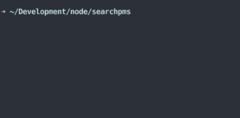

# Search Plex Media Server

Proof of concept command line app. Requires NodeJS, and if you are using Plex Home you need to provide a username and password.

Tested on:

 - Mac OS X 10.11 with Node v4.2.2/v5
 - Windows 7 with Node v4.2.2/v5.1

```
$ npm install
$ node .
```


